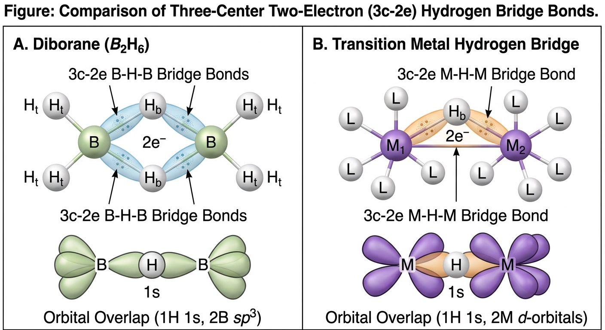

# 氢元素

## 单质氢的物理性质
- 氢是已知的最轻的气体，无色无臭，几乎不溶于水, 氢比空气轻14.38倍，具有很大的扩散速度和很高的导热性。
- 分子氢在地球上的丰度很小，但化合态氢的丰度却很大，仅次于氧而居第二位。

## 氢的化学性质和氢化物

### 氢的成键特征

氢原子的价电子层结构是$1s^1$，电负性是2.1，因此氢原子具有一个价电子和一个空的价层轨道，可以形成共价键、离子键和金属键。

#### 离子键

- H失去一个电子形成$H^+$，具有质子特征，如同酸类水溶液中的$H^+$一样，具有强烈的亲核性和酸性，成离子键。
- 当H与电负性很小的活泼金属，如Li、Na、K等形成化合物时，H获得一个电子形成$H^-$。$H^-$有较大的半径208pm，仅存于离子型氢化物的晶体中，具有强烈的亲电性和碱性，成离子键。

#### 共价键
- 两个H原子通过共享一个电子对形成H$_2$分子，成**非极性共价单键**。
- H原子和非金属元素的原子化合，形成**极性共价键**，如HCl、H$_2$O等。**键的极性随着非金属原子的电负性增大而增强**

#### 金属键与特殊键型
- H原子可以填充到许多过渡金属晶格的空隙中，形成一类非整比化合物，一般称之为**金属型氢化物**，具有金属键特征。
例如：$TiH_{1.5}$、$ZrH_{1.5}$等。
- 在硼氢化合物（例如乙硼烷$B_2H_6$）和某些过渡金属配合物(如Fe_2H)中均存在着氢桥键

- 能形成氢键

### 氢的化学性质

- 常温下，分子氢不活泼。
- 在高温或催化剂存在下，氢气是一个非常好的还原剂

  1. 氢气能和卤素，$N_2$等非金属反应，生成共价型氢化物
    $$H_2 + X_2 \xrightarrow{高温或催化剂} 2HX$$
  2. 氢气与活泼金属反应，生成离子型氢化物
    $$H_2 + 2M \xrightarrow{高温或催化剂} 2MH$$
  3. 氢气能将许多金属氧化物或金属卤化物还原为金属
    $$MO + H_2 \xrightarrow{高温} M + H_2O$$
    $$MX + H_2 \xrightarrow{高温} M + 2HX$$
  4. 加氢反应
    $$C_2H_4 + H_2 \xrightarrow{催化剂} C_2H_6$$ 
- 氢分子在高温、电弧放电、紫外线照射等条件下能发生分解，生成氢原子，具有很强的还原性和亲核性。
  $$H_2 \xrightarrow{高温、电弧放电、紫外线照射} 2H$$
- 把原子氢气流流过金属表面，原子氢结合成分子氢的反应热可以产生高达4273K高温，即原子氢焰。

### 原子氢性质

原子氢是一种比分子氢更强的还原剂

- 原子氢和锗、锡、砷、硫、锑等直接作用生成对应的氢化物
$$H + X \rightarrow HX$$
- 原子氢可以把许多金属氧化物或卤化物迅速还原成金属
$$MO + 2H \rightarrow M + H_2O$$
$$MX + H \rightarrow M + HX$$
- 原子氢甚至能还原某些含氧酸盐
$$BaSO_4 + 8H \rightarrow BaS + 4H_2O$$
### 氢化物
氢化物是氢与其他元素形成的二元化合物。
依据元素电负性的不同，氢化物可以分为三大类：
- 离子型或类盐型氢化物
- 共价型或分子型氢化物
- 金属型或过渡型氢化物

#### 离子型或类盐型氢化物

- 在周期表中，**活泼性最强的碱金属和碱土金属**能够与氢在较高的温度下直接化合，氢获得一个电子成为离子，生成离子型氢化物

#### 共价型或分子型氢化物

- 在周期表中，p区元素的单质（稀有气体、铟、铊除外）与氢结合生成的氢化物属于共价型氢化物，亦称为分子型氢化物 

#### 金属型或过渡型氢化物

- d区或过渡金属的钪族、钛族、钒族以及铬、镍、钯、镧系和锕系的所有元素，还有s区的Be和Mg，与氢生成过渡型氢化物

## 氢气的制备方法
- 实验室制备：锌与稀硫酸反应
$$Zn + H_2SO_4 \rightarrow ZnSO_4 + H_2$$
- 工业制备：天然气重整法
$$CH_4 + H_2O \xrightarrow{高温} CO + 3H_2$$
- 其他方法：电解水、金属氢化物与水反应等